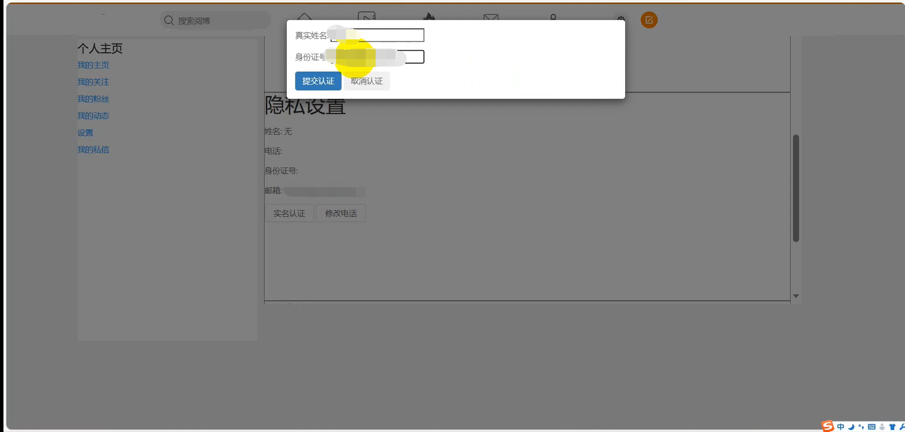

# Grade3_Project

#### Description

The blog project is a social media platform on which users can post essays, pictures, videos, and other content to interact with other users. The platform has the characteristics of real-time, interactive, and personalized. Users can pay attention to other users, browse their dynamics, and can also be followed by other users to share their own lives, views, and experiences. The platform also provides some social functions, such as private messages, comments, likes, etc. to facilitate communication and interaction between users. Projects like Weibo are very popular in the Chinese mainland market, and it is one of the important platforms for people to obtain information, express their opinions and communicate with others.

#### Using tutorials

1. All you need is a browser that can access the Internet.

#### Project screenshot

##### Client

Login

Register

Index

Forward Likes and Comments

Publish YueBo

Report

My Home Page

My Follows

My Fans

My Posts

Settings

Real Name Authentication

Professional Certification

My Private Messages

##### Management System

Login

Index

Sensitive Words

User Report-Not Handled

User Report-Handled

User Report-Report Type

User Management-User List

User Management-Authentication Audit

User Management-Unblock

Post Management

Operation Log

Help

