# Grade3_Project

#### 介绍

阅博项目是一种社交媒体平台，用户可以在上面发布短文、图片、视频等内容，与其他用户互动交流。该平台具有实时性、互动性、个性化等特点，用户可以关注其他用户，浏览他们的动态，也可以被其他用户关注，分享自己的生活、观点和经验。该平台也提供了一些社交功能，如私信、评论、点赞等，方便用户之间的交流和互动。类似微博的项目在中国大陆市场非常流行，是人们获取信息、表达观点、交流社交的重要平台之一。 

#### 使用教程

1. 您只需要一个可以访问互联网的浏览器即可

#### 项目截图

##### 前端

登录

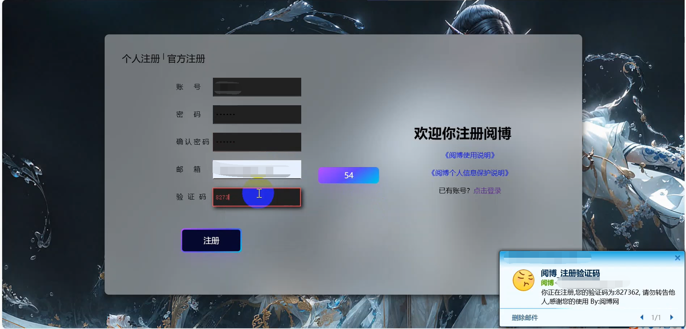

注册

主界面

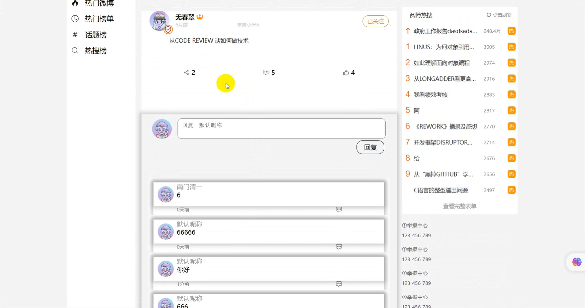

转赞评

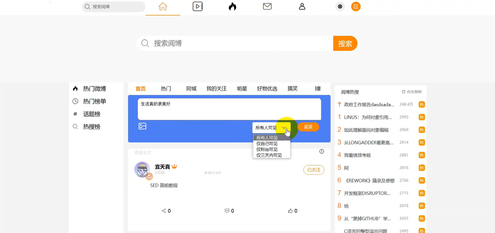

发布阅博

举报

我的主页

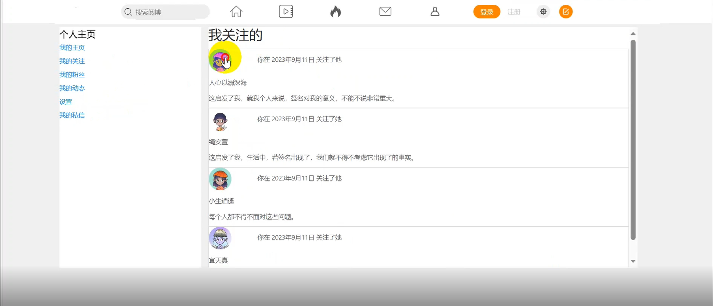

我的关注

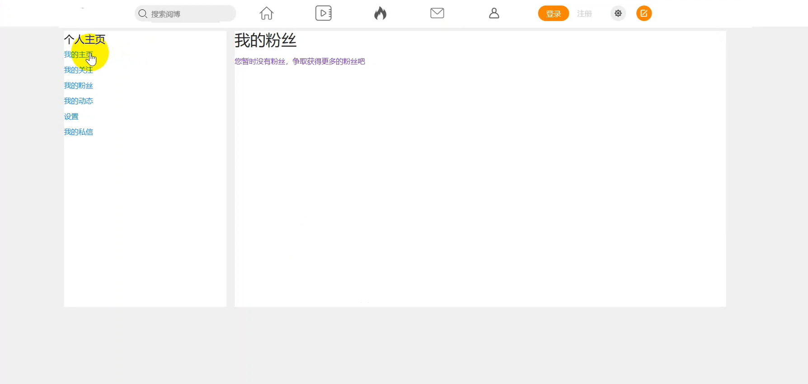

我的粉丝

我的动态

设置

实名认证

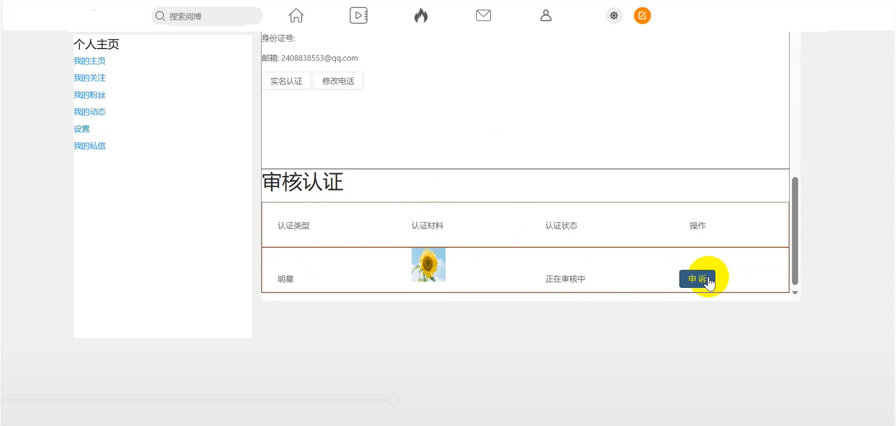

大V认证

我的私信

##### 后台

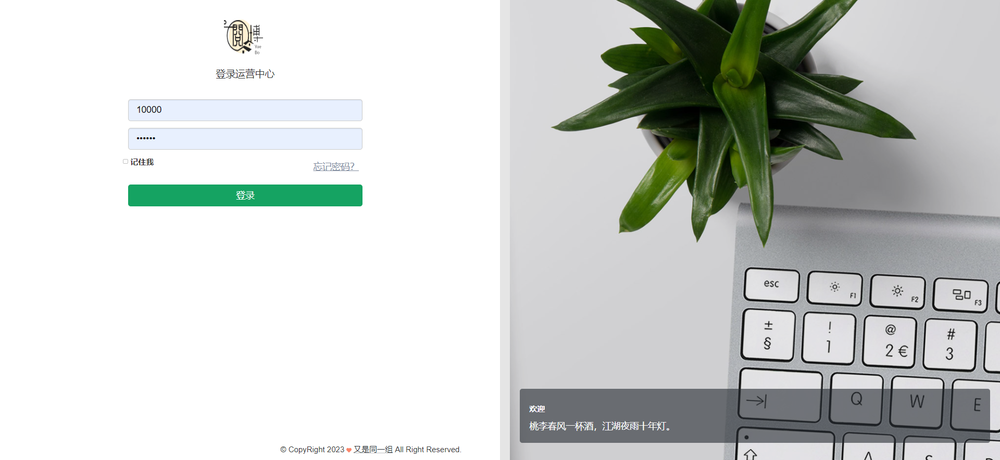

登录

首页

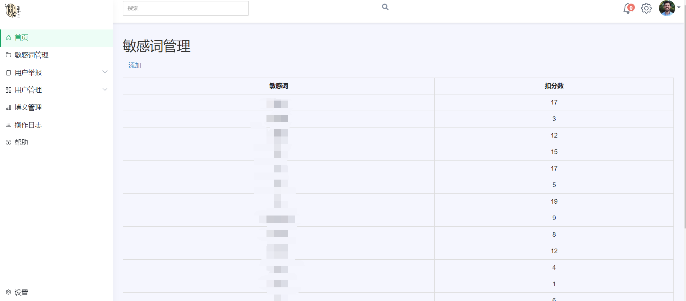

敏感词

用户举报-未处理

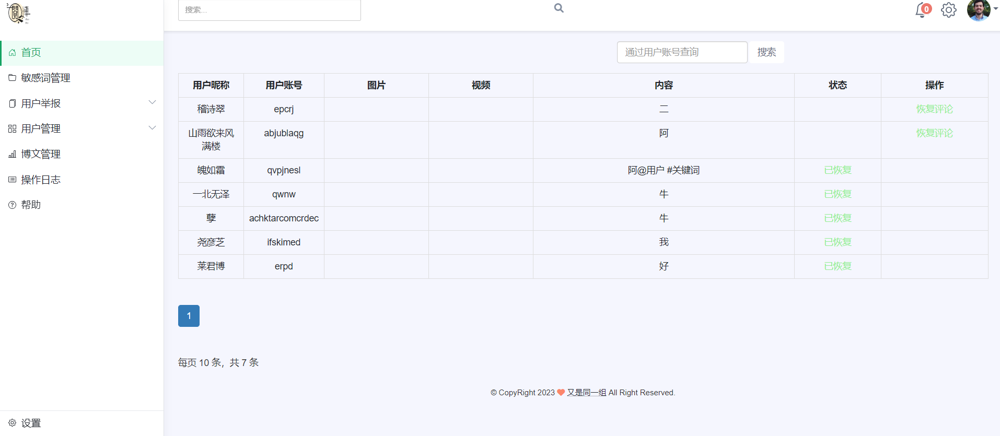

用户举报-已处理

用户举报-举报类型

用户管理-用户列表

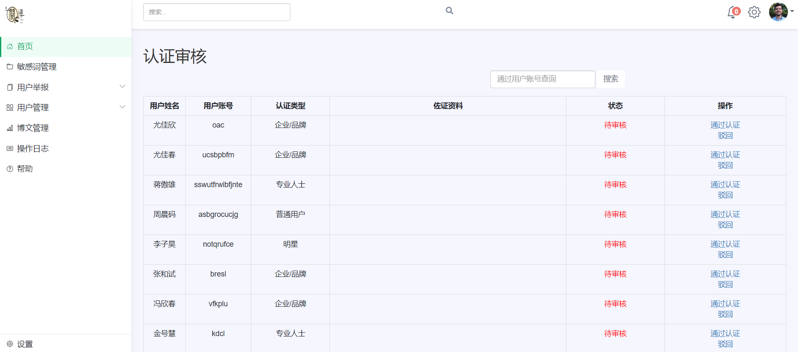

用户管理-认证审核

用户举报-解封用户

博文管理

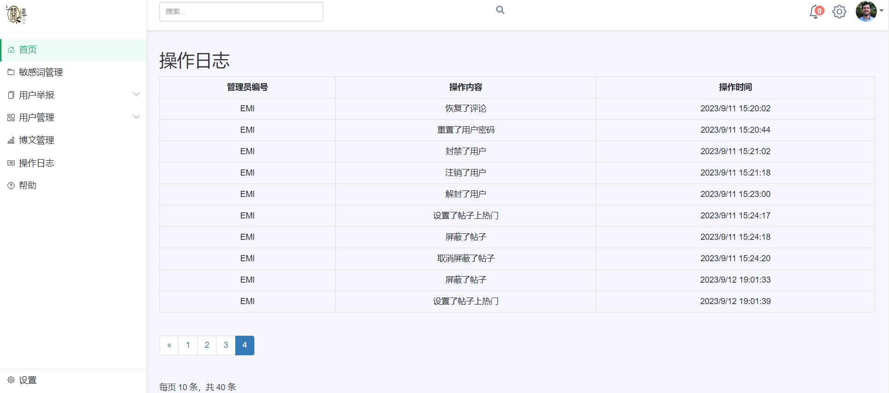

操作日志

帮助

